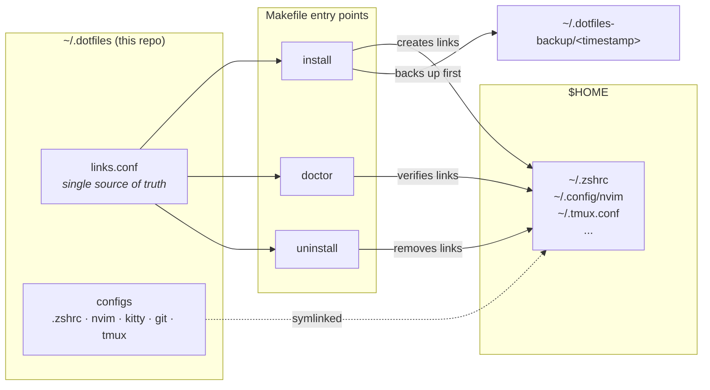

<div align="center">

# dotfiles

**A minimal, opinionated macOS development environment — clone, run, done.**

[](https://github.com/ntwrcht/dotfiles/actions/workflows/ci.yml)
[](#license)
[](https://www.apple.com/macos/)
[](https://www.zsh.org/)
[](https://neovim.io/)

</div>

---

## Introduction

Setting up a new Mac by hand takes days: installing tools one by one, hunting down configuration files, and rediscovering settings you tuned years ago. This repository removes that cost entirely.

**dotfiles** stores every configuration file for your shell, editor, terminal, and Git in a single version-controlled location. One command installs the full toolchain via Homebrew; a second command symlinks each config into place — with automatic backups, an idempotent installer you can re-run safely, and a dry-run mode that previews every change before it happens.

The result: a new machine goes from factory state to a fully configured development environment in minutes, and every future tweak is tracked, reviewable, and reversible.

## Table of Contents

- [Introduction](#introduction)
- [Key Features](#key-features)
- [Architecture Overview](#architecture-overview)
- [Getting Started](#getting-started)
  - [Prerequisites](#prerequisites)
  - [Installation](#installation)
- [Usage](#usage)
  - [Day-to-Day Commands](#day-to-day-commands)
  - [Reading Markdown](#reading-markdown)
  - [Previewing Changes](#previewing-changes)
  - [Managing Secrets](#managing-secrets)
  - [Health Checks](#health-checks)
- [What Gets Configured](#what-gets-configured)
- [Contributing](#contributing)
- [License](#license)

## Key Features

- **One-command setup** — `make deps && make install` takes a fresh Mac to a complete environment.
- **Safe by design** — existing files are backed up to `~/.dotfiles-backup/<timestamp>` before anything is replaced, and `make dry-run` previews every change without touching your system.
- **Idempotent installer** — re-run it any time; links already in place are detected and skipped.
- **Declarative dependencies** — a single [`Brewfile`](./Brewfile) defines the entire toolchain, from Neovim to Nerd Fonts.
- **Built-in diagnostics** — `make doctor` verifies that every tool is installed and every symlink points where it should.
- **Clean removal** — `make uninstall` reverses everything the installer did.
- **Secrets never touch disk** — tokens, database URIs, and SSH passphrases live in the macOS Keychain, reached with `secret` and handed to one command at a time.

## Architecture Overview

The system follows the classic **symlink farm** pattern: configuration files live in this repository, and the installer links them into their expected locations under `$HOME`. Editing a file here immediately affects the live config — no copy step, no drift.



**`links.conf` is the single source of truth.** `install`, `uninstall`, and `doctor` all read it, so adding a managed config is a one-line change rather than three edits that can drift apart.

### Managed links

<!-- BEGIN LINKS -->

| Source in repo | Linked to |
| :--- | :--- |
| `.vimrc` | `~/.vimrc` |
| `.zshrc` | `~/.zshrc` |
| `.config/nvim` | `~/.config/nvim` |
| `.config/kitty` | `~/.config/kitty` |
| `.config/git` | `~/.config/git` |
| `.gitconfig` | `~/.gitconfig` |
| `.tmux.conf` | `~/.tmux.conf` |
| `.editorconfig` | `~/.editorconfig` |

<!-- END LINKS -->

<sub>Generated from [`links.conf`](./links.conf) by `make docs` — do not edit by hand.</sub>

Three design decisions shape the installer:

1. **Non-destructive linking.** Before creating a symlink, `install` moves any existing file to a timestamped backup directory, so nothing is ever silently overwritten.
2. **Convergent state.** Every step checks the current state first — an existing link, an installed plugin, a ready Python provider — and acts only when needed. Running the installer twice produces the same result as running it once.
3. **A single command surface.** The [`Makefile`](./Makefile) wraps every script, so you never need to remember flags: `make install`, `make doctor`, `make uninstall`.

## Getting Started

### Prerequisites

You need exactly one thing installed manually — **[Homebrew](https://brew.sh)**, the package manager for macOS:

```bash
/bin/bash -c "$(curl -fsSL https://raw.githubusercontent.com/Homebrew/install/HEAD/install.sh)"
```

Everything else is handled automatically.

### Installation

**1. Clone the repository**

```bash
git clone git@github.com:ntwrcht/dotfiles.git ~/.dotfiles
cd ~/.dotfiles
```

**2. Install the toolchain**

```bash
make deps
```

Reads the [`Brewfile`](./Brewfile) and installs every tool at once — editor, terminal, shell utilities, fonts, and Git tooling.

**3. Apply the configurations**

```bash
make install
```

This links all config files into place, installs [Oh My Zsh](https://ohmyz.sh) with the [Powerlevel10k](https://github.com/romkatv/powerlevel10k) theme and Zsh plugins, sets up the Neovim Python provider, creates `~/.zshrc.local` for machine-specific settings, and adds the SSH defaults include to `~/.ssh/config`.

Open a new terminal window when it finishes — everything is active.

> **Tip:** Not sure what will happen? Run `make dry-run` first. It prints exactly what the installer would do without changing a single file.

## Usage

### Day-to-Day Commands

Run these from inside `~/.dotfiles`:

| Command | Description |
| :--- | :--- |
| `make install` | Install or update all managed symlinks |
| `make dry-run` | Preview what `install` would change, safely |
| `make uninstall` | Remove all configs applied by this repo |
| `make doctor` | Verify tools are installed and links are correct |
| `make deps` | Install or update all tools via Homebrew |
| `make docs` | Regenerate the generated sections of this README |
| `make cleanup` | Preview Homebrew packages that can be removed |
| `make cleanup-apply` | Remove the packages shown by `cleanup` |

### Reading Markdown

`md` renders markdown in [glow](https://github.com/charmbracelet/glow), picking the file first:

| Command | What it does |
| :--- | :--- |
| `md` | Lists every markdown file below the current directory in fzf, previews the highlighted one, opens the chosen one |
| `md docs/` | The same picker, scoped to a directory |
| `md README.md` | Skips the picker and renders the file |

In the picker, `enter` reads, `ctrl-e` opens the file in `$EDITOR`, and `esc` quits.

Neovim reaches the same reader in a floating terminal: `<leader>m` renders the current markdown buffer, `<leader>M` always starts at the picker, and `:Glow [file]` does either. The script lives in [`bin/md`](./bin/md) and is on `PATH` via [`zsh/path.zsh`](./zsh/path.zsh), so both surfaces run one implementation.

### Previewing Changes

The installer supports a first-class dry-run mode. Every action — links, backups, downloads — is printed instead of executed:

```bash
$ make dry-run

⚠ Running in DRY-RUN mode. No changes will be made.

==> Installing Dotfiles
ℹ 🔗 Linking: ~/.zshrc -> ~/.dotfiles/.zshrc
ℹ 📦 Backing up: ~/.tmux.conf
```

### Managing Secrets

Credentials live in the macOS login Keychain, never in a file, and are passed to one command at a time. `secret` manages them; every item is stored under `dotfiles/<NAME>`, so a search for `dotfiles/` in Keychain Access shows the same list.

| Command | What it does |
|---|---|
| `secret add NAME` | Prompt for the value (hidden) and create or update it |
| `pbpaste \| secret add NAME` | Same, taking the value from the clipboard |
| `secret get NAME` | Print the value |
| `secret has NAME` | Exit 0 if it exists, 1 if not |
| `secret ls` | List names — never values |
| `secret rm [-f] NAME` | Delete, asking first unless `-f` |
| `secret run NAME... -- CMD` | Run `CMD` with `NAME=value` in its environment only |

`add` takes no value argument on purpose, so a secret never lands in shell history. A command typed with a leading space also stays out of history (`HIST_IGNORE_SPACE`).

**Tools that need a token** get it through a one-line wrapper in [`zsh/secrets.zsh`](./zsh/secrets.zsh) — `codex` receives `OPENAI_API_KEY`. Nothing is exported into the shell, so the wrappers apply only to interactive zsh; anything started from Neovim, tmux bindings, or scripts must call `secret` itself — vim-ai does, through `g:vim_ai_token_load_fn` in `init.vim`. `jira` needs no wrapper: jira-cli reads its token from Keychain itself (service `jira-cli`, account = your Jira login), so it works from any shell, script, or editor. `secret add JIRA_API_TOKEN` writes that item too (and `secret rm` removes it), so you still manage the token with `secret`.

**MongoDB** — store one full URI per environment, then connect by name:

```bash
secret add mongo/dev     # paste the URI at the prompt
mdb dev                  # opens mongosh against it
mdb                      # lists environments
```

**SSH** — `~/.ssh/config` stays local, because it holds private hosts and `gcloud` writes to it. Its first line includes the tracked defaults in [`.ssh/dotfiles.conf`](./.ssh/dotfiles.conf) (`UseKeychain`, `AddKeysToAgent`), which store key passphrases in Keychain. Give each key a passphrase once, then load it:

```bash
ssh-keygen -p -f ~/.ssh/id_ed25519
ssh-add --apple-use-keychain ~/.ssh/id_ed25519
```

**SSH hosts** — `sshm` manages the list of servers so you never edit a config file by hand. Hosts it adds go in `~/.ssh/hosts` (local, never committed), which `dotfiles.conf` includes; hosts defined elsewhere, such as gcloud's block, are listed but left alone.

| Command | What it does |
|---|---|
| `sshm` | Pick a host in fzf and connect |
| `sshm ls` | List hosts: name, `user@host:port`, key, and where it is defined |
| `sshm add [NAME HOST] [-u USER] [-p PORT] [-i KEY]` | Add a host — prompts for anything missing |
| `sshm show NAME` | Print the settings ssh will actually use |
| `sshm rm [-f] NAME` | Remove a host (keeps `~/.ssh/hosts.bak`) |
| `sshm test NAME` | Check that key login works, without prompting |
| `sshm key NAME` | Install your public key on the host (`ssh-copy-id`), ending password logins |

After `sshm add shop-prod 34.87.12.5 -u deploy`, connect with `ssh shop-prod`; `scp`, `rsync`, and tunnels use the same name.

Non-secret, machine-specific settings (e.g. `GOPRIVATE`) go in `~/.zshrc.local`, created from [the template](./.zshrc.local.example). The full design is in [docs/design/credential-management.md](./docs/design/credential-management.md).

### Health Checks

If something breaks, the diagnostic tells you exactly what is missing or misconfigured:

```bash
make doctor
```

## What Gets Configured

| Tool | Role | What this config provides |
| :--- | :--- | :--- |
| **[Zsh](https://www.zsh.org)** | Shell | Aliases, smarter history, Powerlevel10k prompt, syntax highlighting, autosuggestions |
| **[Neovim](https://neovim.io)** | Editor | Full plugin setup, installed automatically on first launch |
| **[Kitty](https://sw.kovidgoyal.net/kitty)** | Terminal | Font, colors, and keyboard shortcuts |
| **[Tmux](https://github.com/tmux/tmux)** | Multiplexer | An owned ~90-line config — vi copy mode, mouse, seamless pane navigation with Neovim |
| **[Git](https://git-scm.com)** | Version control | Global ignore rules, commit template, [delta](https://github.com/dandavison/delta) diffs |

The Brewfile also installs modern CLI replacements — [eza](https://github.com/eza-community/eza) (`ls`), [bat](https://github.com/sharkdp/bat) (`cat`), [fd](https://github.com/sharkdp/fd) (`find`), [ripgrep](https://github.com/BurntSushi/ripgrep) (search), [fzf](https://github.com/junegunn/fzf) (fuzzy finding), [glow](https://github.com/charmbracelet/glow) (markdown), [zoxide](https://github.com/ajeetdsouza/zoxide) (smarter `cd`) — plus [Lazygit](https://github.com/jesseduffield/lazygit), [jq](https://jqlang.github.io/jq), and the [fnm](https://github.com/Schniz/fnm) and [uv](https://github.com/astral-sh/uv) runtime managers.

## Contributing

Contributions are welcome — whether it is a bug fix, a new tool integration, or an improvement to the installer.

1. **Fork** the repository and create a feature branch: `git checkout -b feat/my-improvement`
2. **Make your change.** Keep scripts POSIX-friendly Bash with `set -euo pipefail`, and test with `make dry-run` before `make install`.
3. **Verify** with `make doctor` on a clean run. CI runs `shellcheck`, `zsh -n`, and a dry-run install on macOS.
4. **Open a pull request** with a clear description of the problem and your solution.

Found a bug or have an idea? [Open an issue](https://github.com/ntwrcht/dotfiles/issues) — clear reproduction steps make fixes fast.

## License

Distributed under the **MIT License**. See [`LICENSE`](./LICENSE) for full text.

You are free to fork this repository and adapt it into your own dotfiles — that is the whole point.

---

<div align="center">
  <sub>made for macOS · built to last · yours to fork</sub>
</div>
