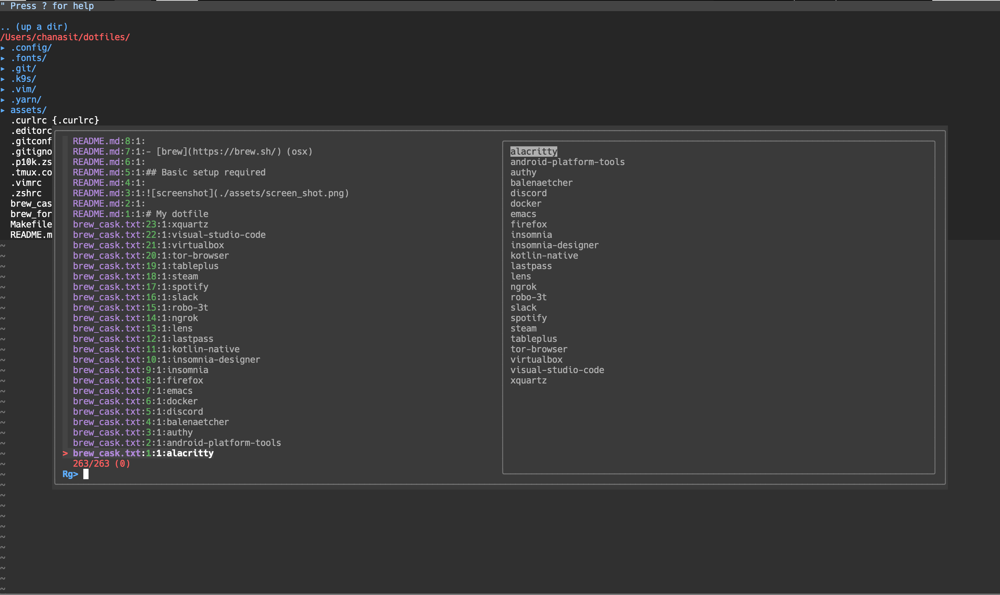
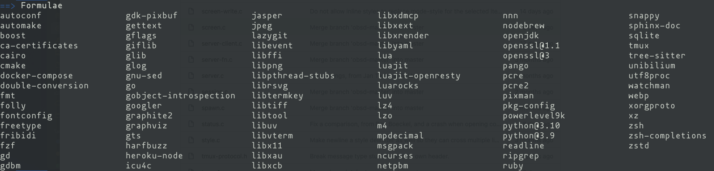

# Dotfiles




Personal macOS dotfiles for shell, Git, Neovim, tmux, and Kitty.

## Installation

```bash
git clone git@github.com:Canvas-xxx/dotfiles.git ~/.dotfiles
cd ~/.dotfiles
./install
make doctor
```

The installer creates symlinks into your home directory. Existing files are moved to:

```bash
~/.dotfiles-backup/<timestamp>
```

Preview changes without modifying files:

```bash
./install --dry-run
```

## Commands

```bash
make dry-run   # preview symlink changes
make install   # install dotfile symlinks
make doctor    # check required and optional tools
make deps      # install Homebrew dependencies from Brewfile
make cleanup   # preview Homebrew runtime cleanup candidates
```

The installer also creates `~/.zshrc-secrets` when it is missing and creates a dedicated Neovim Python provider virtualenv at `~/.local/share/nvim/python-provider`.

## Dependencies

Install Homebrew packages:

```bash
brew bundle
```

Useful tools included in the `Brewfile`:

- [bat](https://github.com/sharkdp/bat)
- [ddgr](https://github.com/jarun/ddgr)
- [eza](https://github.com/eza-community/eza)
- [fd](https://github.com/sharkdp/fd)
- [fnm](https://github.com/Schniz/fnm)
- [nnn](https://github.com/jarun/nnn)
- [ripgrep](https://github.com/BurntSushi/ripgrep)
- [lazygit](https://github.com/jesseduffield/lazygit)
- [fzf](https://github.com/junegunn/fzf)
- [git-delta](https://github.com/dandavison/delta)
- [jq](https://github.com/jqlang/jq)
- [neovim](https://github.com/neovim/neovim)
- [nerd-fonts](https://github.com/ryanoasis/nerd-fonts)
- [tealdeer](https://github.com/tealdeer-rs/tealdeer)
- [uv](https://github.com/astral-sh/uv)
- [yarn](https://github.com/yarnpkg/yarn)
- [zoxide](https://github.com/ajeetdsouza/zoxide)

## Runtime Management

Use Homebrew for system packages and runtime managers, not for locking every project runtime.

For Node.js, prefer `fnm` and install an LTS release per machine or per project:

```bash
fnm install --lts
fnm default lts-latest
```

The shell initializes `fnm` when it is installed. The old `nodebrew` path is only used as a fallback when no `node` command is available.

For Python, keep `python3` from Homebrew or the system as the base interpreter. Use `uv` or project virtualenvs for project dependencies instead of pinning a global Python path in `.zshrc`.

To review old runtime managers or leftover Homebrew runtime formulae:

```bash
make cleanup
./cleanup-deps --apply
```

Cleanup is dry-run by default. Formulae declared in this repo's `Brewfile` are kept out of the cleanup candidates. The apply mode still asks before uninstalling each formula.

## Neovim Plugins

Neovim bootstraps [lazy.nvim](https://github.com/folke/lazy.nvim) on first start.

After installation, open Neovim and run:

```vim
:Lazy sync
```

Validate the editor setup with:

```vim
:checkhealth
```

This repo is Neovim-first. The tracked `.vimrc` is only a small fallback message for plain Vim.

## Tmux

Follow this link for [tmux](https://github.com/tmux/tmux) and [oh-my-tmux](https://github.com/gpakosz/.tmux) pre-installation guide

## Secrets

Do not commit local credentials or tokens. Keep machine-specific secret files outside Git, or use example files with placeholder values.

For shell credentials, copy the example file and edit the local copy:

```bash
cp .zshrc-secrets.example ~/.zshrc-secrets
chmod 600 ~/.zshrc-secrets
```

The installer creates this file automatically when it is missing and never overwrites an existing one.

Then put real values in `~/.zshrc-secrets`:

```bash
export JIRA_API_TOKEN="..."
export OPENAI_API_KEY="..."
```
